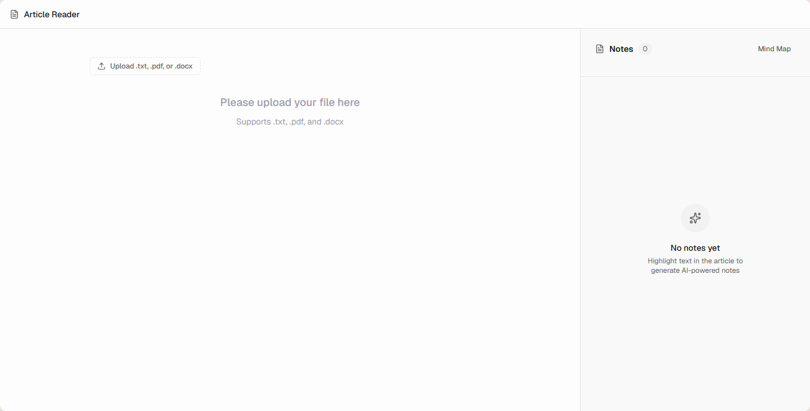

# Article Reader

### AI-Assisted Context-Aware Note-Taking System

Article Reader is a prototype AI-assisted note-taking system designed to reduce users’ cognitive burden during reading and learning workflows. Instead of relying heavily on manual prompting, Article Reader uses text selection behavior to infer users’ intent and automatically generate structured notes connected to their original sources.



---

# Project Motivation

Current AI tools such as ChatGPT, Notion AI, and Copilot often require users to constantly stop their workflows to write prompts and manually provide context. This creates several problems:

- High prompting burden
- Workflow interruption
- Cognitive burden

Article Reader aims to address these issues by supporting:

- Prompt-free interaction
- Context-aware note generation
- Source-linked AI outputs
- Lightweight workflow integration

---

# Core Features

## 1. Rule-Based Intent Detection

When users highlight text, Article Reader automatically assigns an intent label using simple heuristics such as:

- Word count
- Sentence count
- Keywords

Example inferred tasks include:

- Summarization
- Explanation
- Key points
- Question

If users are not satisfied with the assigned label, they can manually change it. This allows the system to reduce manual task specification while keeping users in control.

---

## 2. AI-Generated Contextual Notes

After detecting the inferred task, Article Reader generates notes directly from the selected text.

The system currently uses lightweight template-based prompt generation for the MVP version.

---

## 3. Source Linking

Each generated note remains connected to its original source text.

Features include:

- Footnote-style source references
- Source highlighting
- Bidirectional navigation between notes and source text

This helps users verify AI outputs and improves explainability.

---

## 4. Note Organization System

Article Reader supports lightweight note management features including:

- Sorting notes by:
    - Order of appearance in the article
- Filtering notes by:
    - Task label
- Editable labels on note cards

The system focuses on minimizing organizational friction during learning workflows.

---

## 5. PDF Upload & Reading Support

Users can upload .txt, .pdf, and .docx documents directly into the interface.

The system extracts text content using OCR/PDF parsing and allows users to:

- Read documents
- Highlight content
- Generate contextual notes
- Navigate between notes and source material

---

# System Workflow

1. User uploads a document
    
    
    
2. User highlights text
    
    
    
3. Article Reader assigns task label
4. Note is generated
5. Assigned label can be modified
    
    
    
6. Generated note is linked back to source text
    
    
    
7. Notes can be filtered
    
    
    
8. A mind map of the overview of the article is provided
    
    
    
    
    
9. Notes can be exported as .md file
    
    
    

---

# Technologies Used

- Next.js
- React
- TypeScript
- pnpm
- pdfjs-dist
- Tailwind CSS

---

# Prototype Scope (MVP)

This prototype focuses on interaction design exploration rather than production-level AI infrastructure.

Current MVP simplifications include:

- Rule-based intent inference instead of machine learning
- Template-based prompt generation
- OCR/PDF parsing instead of full multimodal understanding
- Simple source-linking system

---

# Current Limitations

## 1. PDF Structure Parsing

PDF parsing does not perfectly preserve the original document hierarchy.

Known issues include:

- Incorrect heading detection
- Improper paragraph segmentation
- Flattened text structure

To preserve source-linking consistency, all content is currently treated as body text.

---

## 2. Limited AI Integration

The current prototype uses simplified note generation logic rather than a fully connected LLM pipeline.

Future versions aim to integrate:

- Real AI APIs
- Better contextual understanding
- More accurate summarization

---

# Future Improvements

- Real-time AI note generation
- Improved PDF structure understanding
- Better multimodal interaction support
- Export options for notes

---

# Installation & Setup

## Prerequisites

Install:

- Node.js
- pnpm

---

## Clone Repository

```bash
git clone https://github.com/XinxuanShen/info490-prototype-1.git
cd info490-prototype-1
```

---

## Link to APP

```
https://info490-prototype-1.vercel.app/
```